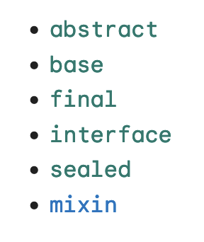

공식문서 링크<br/>
[https://dart.dev/language/class-modifiers](https://dart.dev/language/class-modifiers)

<br/>

## Class modifiers

<br/>



<br/>
<br/>

- Class modifier 들은 `class` 나 `mixin` 앞에 와서 사용할 수 있다.
- 여기서 `base` 만, `mixin`앞에서만 쓸 수 있다.

<br/>

### abstract

<br/>

```dart
abstract class Vehicle {
  void moveForward(int meters);
}
```

<br/>

- 클래스나 믹스인의 청사진만 만드록 구체적인 구현을 하지 않는다면 `abstract`를 사용한다. 

<br/>

```dart
import 'a.dart';

// Error: Can't be constructed.
Vehicle myVehicle = Vehicle();

// Can be extended.
class Car extends Vehicle {
  int passengers = 4;

  @override
  void moveForward(int meters) {
    // ...
  }
}

// Can be implemented.
class MockVehicle implements Vehicle {
  @override
  void moveForward(int meters) {
    // ...
  }
}
```
<br/>

- `abstract` 클래스는 인스턴스화 할 수 없지만 `factory` 를 통해서 인스턴스화는 가능하다.
- 위 코드에서 눈여겨볼점은 `implement`는 다중 구현이 가능하지만, `extends`는 단일 상속만 가능하다.

<br/>

### base

```dart
base class Vehicle {
  void moveForward(int meters) {
    // ...
  }
}

import 'a.dart';

// Can be constructed.
Vehicle myVehicle = Vehicle();

// Can be extended.
base class Car extends Vehicle {
  int passengers = 4;
  // ...
}

// ERROR: Can't be implemented.
base class MockVehicle implements Vehicle {
  @override
  void moveForward() {
    // ...
  }
}
```

<br/>

- `base` 는 라이브러리 외부에서 implement 할 수 없다. 반면 라이브러리 내부에서는 일반적인 `class`와 동일하다고 볼 수 있다. 이를 통해 라이브러리 외부에서의 확장을 제한한다.
- 위 코드를 보면 알 수 있듯이 `Vehicle`은 `implements` 할 수 없다. 자체적으로 구현을 강제하기 때문에 `extend`만 가능하다. (상속 강제)
- 반드시 베이스 클래스를 상속하거나 구현하는 클래스에는 `base`, `final`, `sealed`가 들어가야한다.

<br/>


### interface

```dart
interface class Vehicle {
  void moveForward(int meters) {
    // ...
  }
}

import 'a.dart';

// Can be constructed.
Vehicle myVehicle = Vehicle();

// ERROR: Can't be inherited.
class Car extends Vehicle {
  int passengers = 4;
  // ...
}

// Can be implemented.
class MockVehicle implements Vehicle {
  @override
  void moveForward(int meters) {
    // ...
  }
}
```

<br/>

- 추상 클래스와 인터페이스의 차이점은 그 목적이라고 할 수 있다. 추상 클래스는 기본적으로 클래스 이며 이를 상속, 확장하여 사용하기 위한 것입니다. 반면 인터페이스는 해당 인터페이스를 구현한 객체들에 대한 동일한 사용방법과 동작을 보장하기 위해 사용한다

<br/>

### abstract interface

- `abstract interface` 를 사용하면 순수 인터페이스를 정의할 수 있으며, 이는 다른 라이브러리에서 구현할 수 있지만 상속할 수 없어 확장이 불가능하다. (`interface` 의 경우에는 상속받아 확장가능)

<br/>

### final 

```dart
final class Vehicle {
  void moveForward(int meters) {
    // ...
  }
}

import 'a.dart';

// Can be constructed.
Vehicle myVehicle = Vehicle();

// ERROR: Can't be inherited.
class Car extends Vehicle {
  int passengers = 4;
  // ...
}

class MockVehicle implements Vehicle {
  // ERROR: Can't be implemented.
  @override
  void moveForward(int meters) {
    // ...
  }
}
```

<br/>

- 위 코드에서 알 수 있듯이 `final` 키워드는 `extends`(확장), `implements`(채택)를 모두 막는 class modifier이다.


<br/>

### sealed

```dart
sealed class Vehicle {}

class Car extends Vehicle {}

class Truck implements Vehicle {}

class Bicycle extends Vehicle {}

// ERROR: Can't be instantiated.
Vehicle myVehicle = Vehicle();

// Subclasses can be instantiated.
Vehicle myCar = Car();

String getVehicleSound(Vehicle vehicle) {
  // ERROR: The switch is missing the Bicycle subtype or a default case.
  return switch (vehicle) {
    Car() => 'vroom',
    Truck() => 'VROOOOMM',
  };
}
```

<br/>

- 하위타입의 enumerable 한 집합을 만들려면 sealed 제어자를 사용한다. 즉 `sealed`를 사용하면 단어그대로 하위타입들을 정적으로 봉인해버릴 수 있다.
- `abstract` 클래스의 일종이며 실제 사용할 때는 묶여있는 하위 클래스들을 `switch` 문에서 모두 분기처리해주어야한다. 