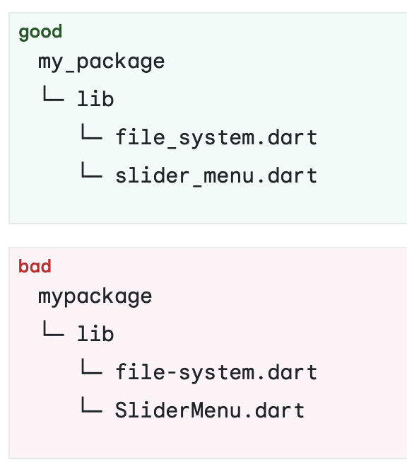
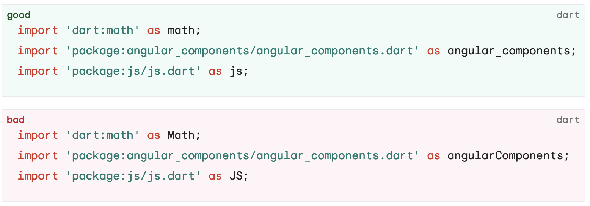
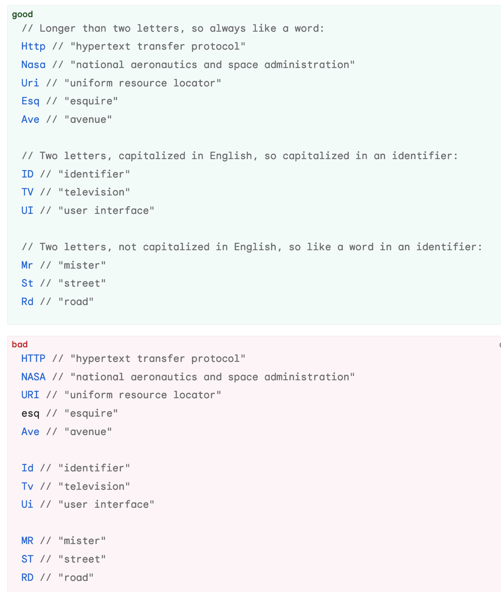
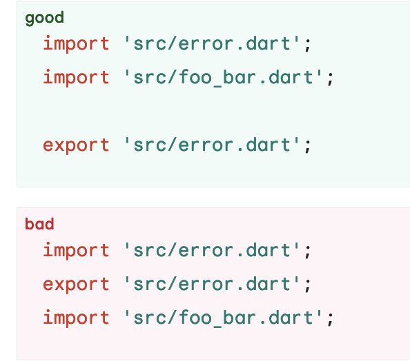
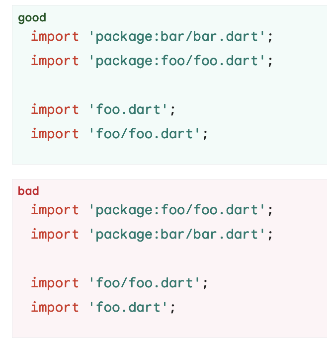
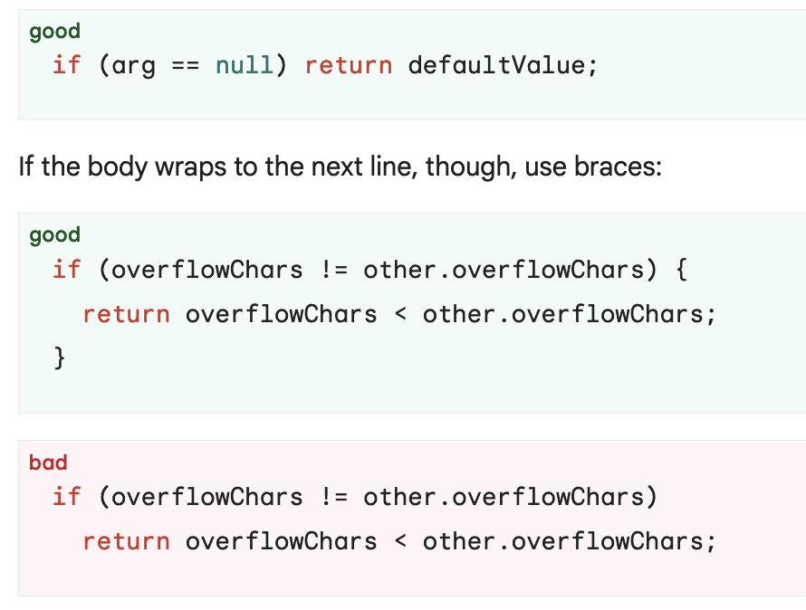

공식문서 링크<br/>
[https://dart.dev/effective-dart/style](https://dart.dev/effective-dart/style)

<br/>

## Effective Dart: Style

<br/>

### Do name types using UpperCamelCase

```dart
class SliderMenu { ... }

class HttpRequest { ... }

typedef Predicate<T> = bool Function(T value);
```

<br/>

- 타입명은 UpperCamelCase로 쓰기
  
<br/>

### Do name extensions using UpperCamelCase

```dart
extension MyFancyList<T> on List<T> { ... }

extension SmartIterable<T> on Iterable<T> { ... }
```

<br/>

- extension으로 써줄 때도 타입은 UpperCamelCase로 쓸 것

<br/>

### DO name packages, directories, and source files using lowercase_with_underscores

<br/>



<br/>
<br/>

- 파일명과 패키지명은 lowercase에 띄어쓰기는 언더바로 하기
  
<br/>

### Do name import prefixes using lowercase_with_underscores

<br/>



<br/>
<br/>


- 패키지 prefix는 lowercase + 언더바 조합으로 작성한다.

<br/>

### Do name other identifiers using lowerCamelCase

```dart
var count = 3;

HttpRequest httpRequest;

void align(bool clearItems) {
  // ...
}
```

<br/>

- 이외의 변수, 파라미터등의 네이밍은 lowerCamelCase로 작성한다.

<br/>


### Do capitalize acronyms and abbreviations longer than two letters like words



<br/>
<br/>

- 축약어나 대문자가 두개를 초과할 경우 소문자를 사용한다. 예를 들어 HTTP는 Http로 써준다.
- 즉 최대한 대문자를 길게 늘여쓰는 것은 피하도록 하자.

<br/>

### PREFER using _, __, etc. for unused callback parameters

```dart
futureOfVoid.then((_) {
  print('Operation complete.');
});
```

<br/>

- 사용하지 않는 콜백은 `_` 언더바로 처리해주자.

<br/>

### DON'T use a leading underscore for identifiers that aren't private

- `private` 처리해줄게 아니라면 앞에 언더바를 사용해주어선 안된다.


<br/>

### DON'T use prefix letters

```dart
defaultTimeout //good

kDefaultTimeout //bad
```

<br/>

- prefix를 사용하는 것을 최대한 지양하자

<br/>

### DON'T explicitly name libraries


```dart 

@TestOn('browser')
library; //good

library my_library; //bad
```

<br/>

- 라이브러리에 나만의 네이밍을 붙일 수 있는 기능은 있지만 왠만하면 사용하지말자. 나중에 다트가 파일경로 찾는데 에러가 날 수도 있다고 한다.

<br/>

### Do place dart: imports before other imports

```dart
import 'dart:async';
import 'dart:html';

import 'package:bar/bar.dart';
import 'package:foo/foo.dart';
```

<br/>

- 다트로 시작하는 패키지부터 앞에 작성하고 한 줄 띄우고 다음패키지를 작성해주도록 하자

<br/>

### Do specify exports in a separate section after all imports

<br/>



<br/>
<br/>

- `export`는 `import`를 모두 한뒤에 작성해주도록 하자

<br/>


### Do sort sections alphabetically

<br/>



<br/>
<br/>

- 각 `import` 영역은 알파벳 순으로 정렬해주도록 하자


<br/>

### AVOID lines longer than 80 characters

- 최대한 간결하게 네이밍하자 특히 class 같은 타입 네이밍은 간결하게 하는 것이 좋다.
- 한 줄에 **80글자**를 넘겨서는 안된다. (예외: URI, 파일경로, multi line string)

<br/>

### DO use curly braces for all flow control statements



<br/>
<br/>

- `else` 문 없이 한 줄에 끝난다면 중괄호 없이 위와 같이써준다.
- 한 줄이 넘어가면 중괄호를 써준다. 